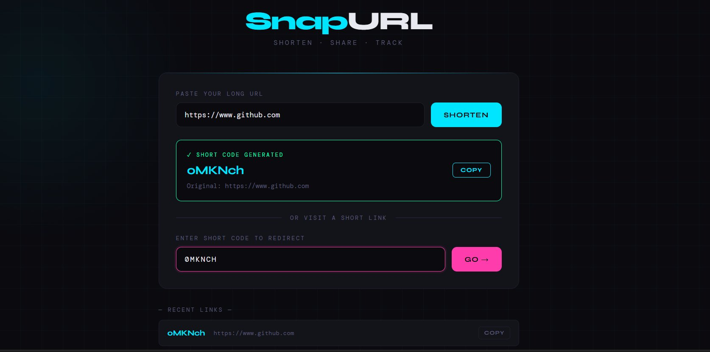
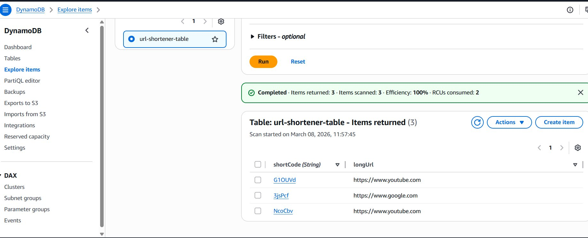
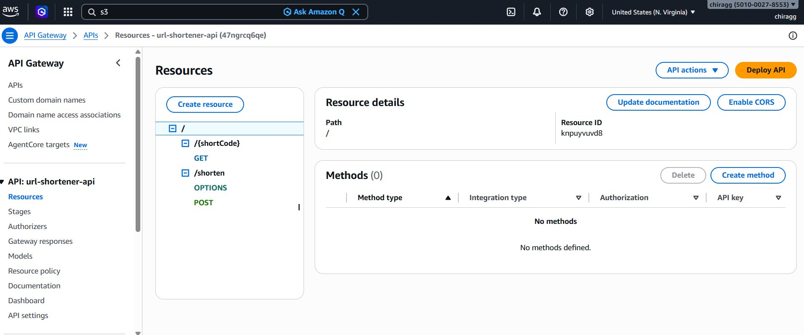
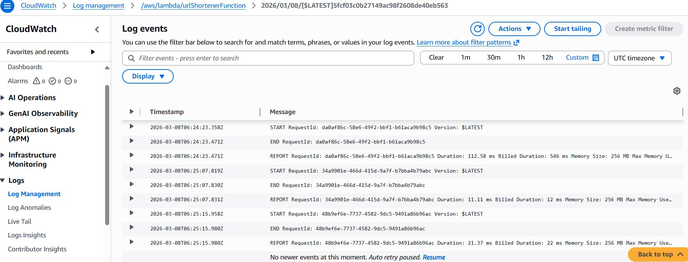

# 🔗 SnapURL — Serverless URL Shortener

A fully serverless URL shortener built on AWS that converts long URLs into short codes instantly, stores them in DynamoDB, and redirects users when accessed.

---

## 🏗️ Architecture

```
User enters long URL
        ↓
S3 Static Website (Frontend)
        ↓
API Gateway (REST API)
        ↓
AWS Lambda (Python 3.11)
        ↓
DynamoDB (Stores shortCode → longURL)
        ↓
Short code generated & returned ✅
```

---

## ☁️ AWS Services Used

| Service | Purpose |
|---|---|
| **Amazon S3** | Host static frontend website |
| **Amazon API Gateway** | Handle HTTP requests (POST & GET) |
| **AWS Lambda** | Generate short codes & fetch URLs |
| **Amazon DynamoDB** | Store short code to URL mappings |
| **Amazon CloudWatch** | Monitor logs and debug errors |
| **IAM Role** | Permissions for Lambda to access DynamoDB |

---

## 📸 Screenshots

### 1. SnapURL Website — Short Code Generated


### 2. DynamoDB Table — Stored URL Mappings


### 3. API Gateway — REST API Routes


### 4. CloudWatch Logs — Successful Lambda Execution


---

## 🧠 Lambda Function Code

```python
import boto3
import json
import random
import string

dynamodb = boto3.resource('dynamodb')
table = dynamodb.Table('url-shortener-table')

CORS_HEADERS = {
    'Access-Control-Allow-Origin': '*',
    'Access-Control-Allow-Headers': 'Content-Type,X-Amz-Date,Authorization,X-Api-Key',
    'Access-Control-Allow-Methods': 'GET,POST,OPTIONS'
}

def generate_short_code():
    return ''.join(random.choices(string.ascii_letters + string.digits, k=6))

def lambda_handler(event, context):
    http_method = event.get('httpMethod', '')

    if http_method == 'OPTIONS':
        return {'statusCode': 200, 'headers': CORS_HEADERS, 'body': ''}

    if http_method == 'POST':
        body = json.loads(event.get('body', '{}'))
        long_url = body.get('longUrl', '')
        short_code = generate_short_code()
        table.put_item(Item={'shortCode': short_code, 'longUrl': long_url})
        return {
            'statusCode': 200,
            'headers': CORS_HEADERS,
            'body': json.dumps({'shortCode': short_code})
        }

    elif http_method == 'GET':
        path = event.get('pathParameters') or {}
        short_code = path.get('shortCode', '')
        response = table.get_item(Key={'shortCode': short_code})
        item = response.get('Item')
        if not item:
            return {'statusCode': 404, 'headers': CORS_HEADERS,
                    'body': json.dumps({'error': 'URL not found'})}
        return {
            'statusCode': 200,
            'headers': CORS_HEADERS,
            'body': json.dumps({'longUrl': item['longUrl']})
        }
```

---

## 🚀 How to Deploy

**Step 1:** Create DynamoDB Table → `url-shortener-table` → Partition key: `shortCode`

**Step 2:** Create IAM Role → Lambda → `AmazonDynamoDBFullAccess` + `AWSLambdaBasicExecutionRole`

**Step 3:** Create Lambda → Python 3.11 → Paste code → Timeout 30s → Memory 256MB

**Step 4:** Create API Gateway → `POST /shorten` + `GET /{shortCode}` → Enable CORS → Deploy to `prod`

**Step 5:** Host Frontend → S3 bucket → Static website hosting → Upload `index.html`

**Step 6:** Test → Paste URL → Click SHORTEN → Use code to redirect ✅

---

## 💡 Use Cases
- Alternative to Bitly / TinyURL
- Marketing campaign links
- Can be extended to track clicks

---

> Built on AWS Free Tier 🎯
